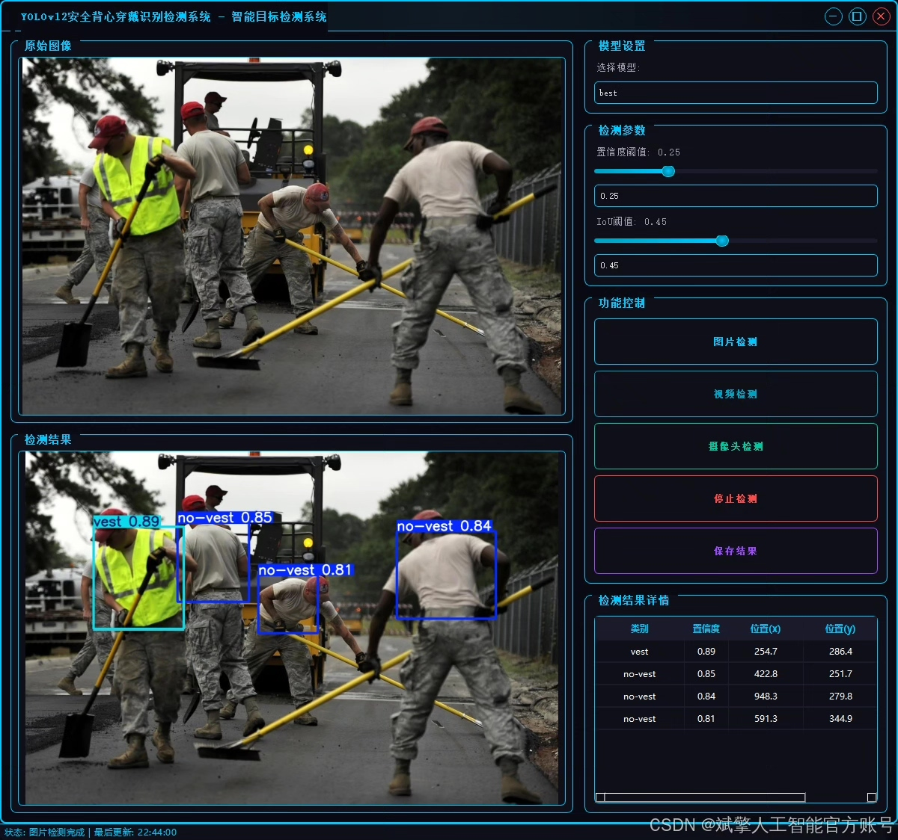
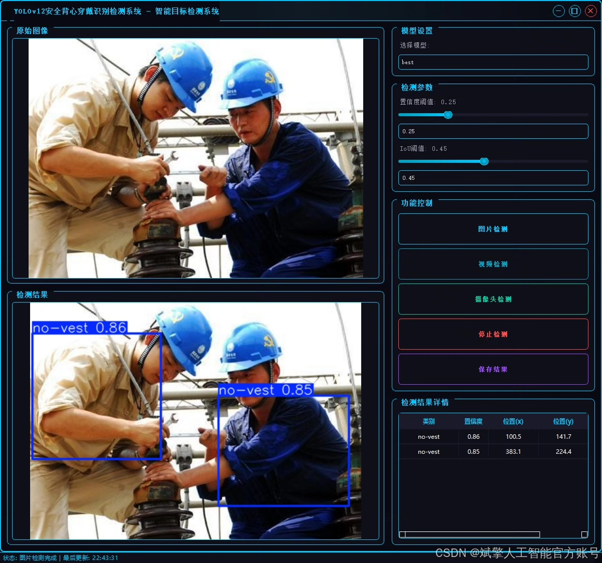
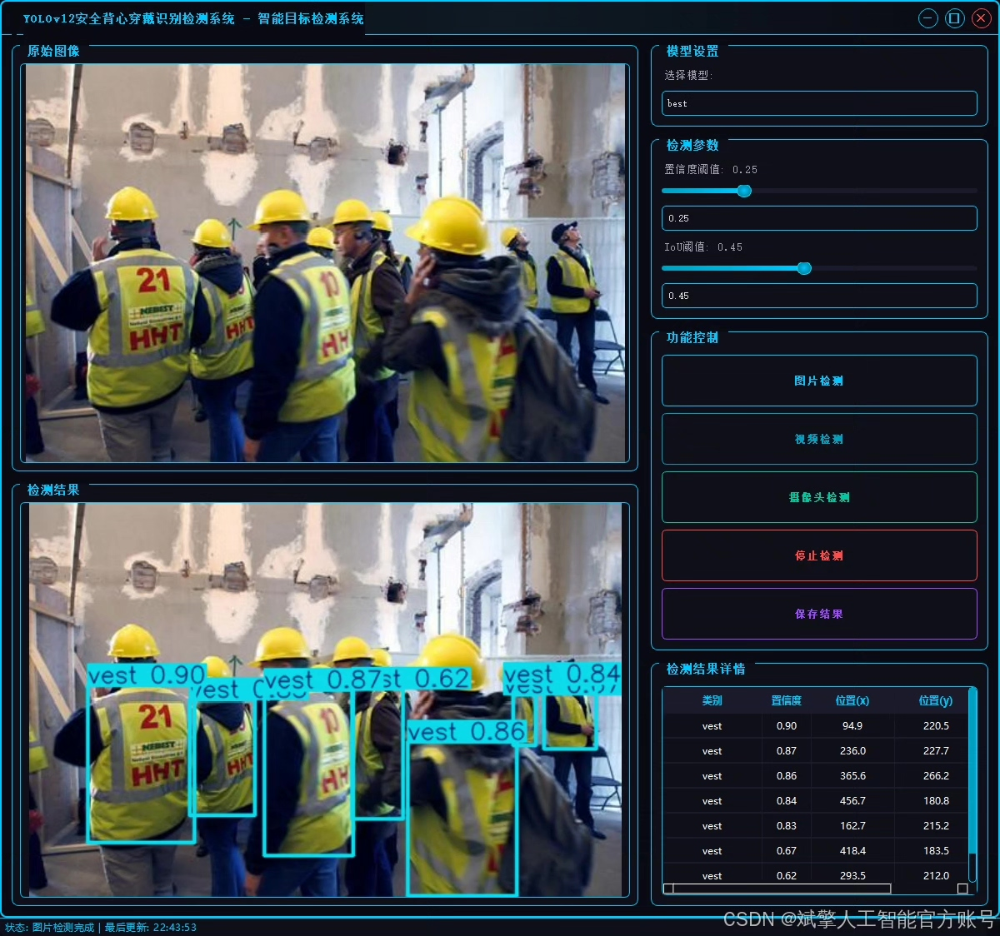
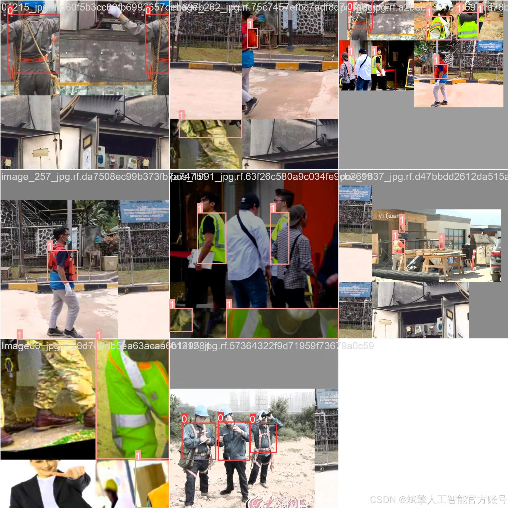
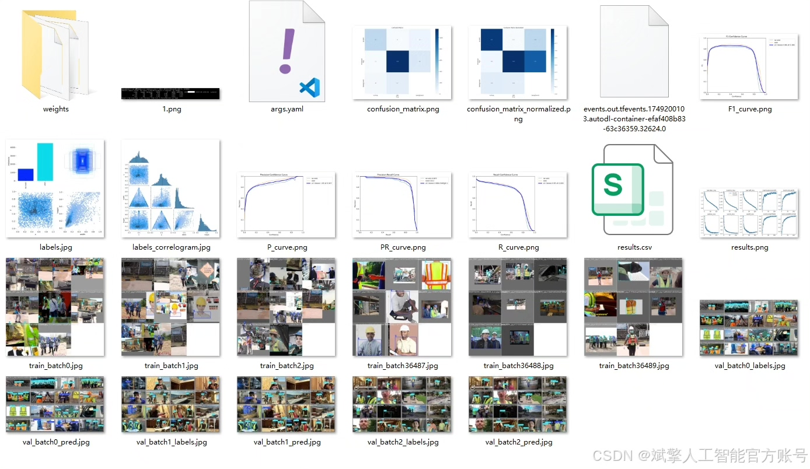
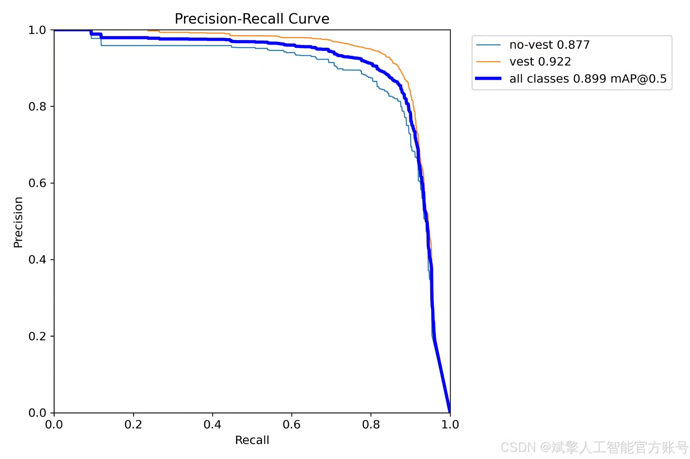
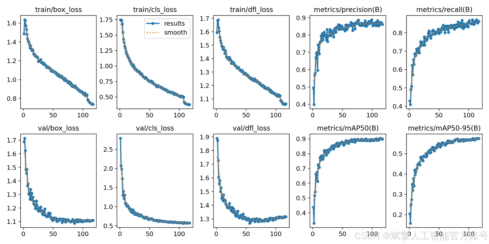
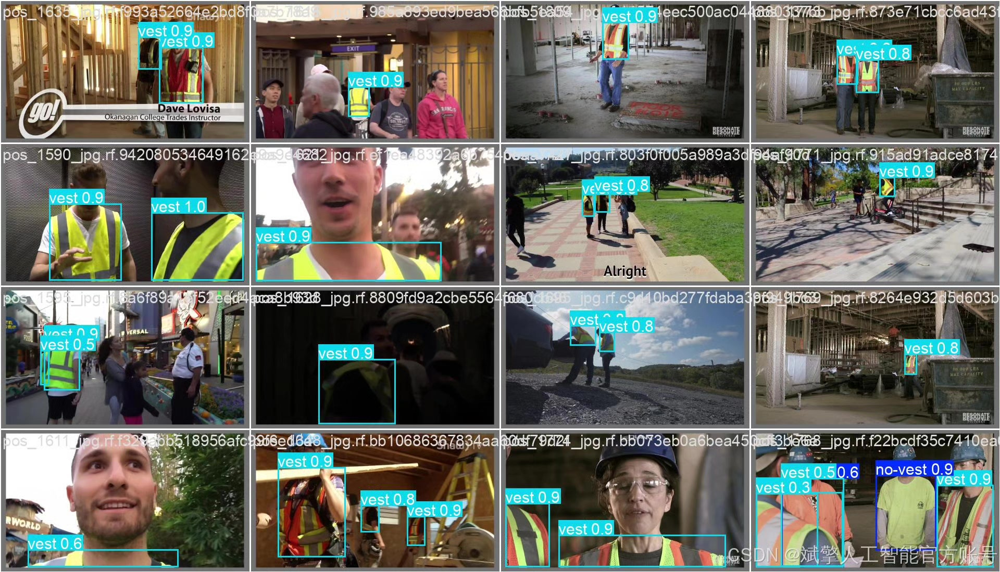

# YOLOv12 safety vest detection system

## Body

YOLOv12 Security Vest Detection System Based on Deep Learning YOLOv12: A Safety Vest Wear Recognition and Detection System for Workers (YOLOv12+YOLO dataset + UI interface + login registration interface + Python project source code + model)

This paper proposes a deep learning object detection algorithm YOLOv12-based safety vest wear recognition and detection system, aiming to detect whether workers are properly wearing safety vests in real-time and accurately, thereby enhancing the level of safety management at the workplace. The system utilizes an improved YOLOv12 model, combined with a high-quality custom YOLO dataset (comprising 2728 training images, 779 validation images, and 390 test images), to optimize detection accuracy and speed. Additionally, the system is equipped with a user-friendly UI interface that supports login registration functions.

✅ User Login & Registration: Supports password verification and security validation.
✅ Three Detection Modes: Based on the YOLOv12 model, supporting image, video, and real-time camera detection, to precisely identify targets.
✅ Dual-Screen Comparison: Displays original images and detection results side by side on the screen.
✅ Data Visualization: Real-time table displaying the category, confidence, and coordinates of detected targets.
✅ Intelligent Parameter Tuning: Offers a confidence slide bar to dynamically optimize detection accuracy, adapting to different scene requirements.
✅ Sci-Fi Interactive Interface: Dark theme paired with dynamic light effects, reducing visual fatigue and enhancing operational experience.

## Images

## Payment

Here is a pay link on Stripe ( https://buy.stripe.com/3cs8yP7sY87d0vu9AB ). Please contact me lonlonago@foxmail.com after funding $89, and I will send you a complete data files , thank you!

